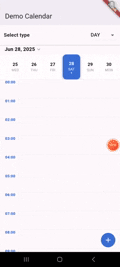
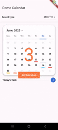
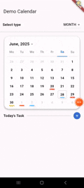

### ☕ Buy Me a Coffee

[](https://buymeacoffee.com/bimki)

# 📅 Multi View Calendar (Flutter)

`multi_view_calendar` is a powerful and customizable Flutter calendar package that provides **week**, **month**, and **year** views out of the box. It is responsive, efficient, and ideal for productivity, planner, and scheduling apps.

---

## 🎬 Demo Video
| Day Demo                 | Week Demo                 | Month Demo                 | Year Demo                 |
|--------------------------|---------------------------|----------------------------|---------------------------|
|  |  |  |  |
---

## 🧩 Features

- 📆 **Multiple views**: DayView, WeekView, MonthView, and YearView
- 🧠 Intelligent layout: Automatically arranges days and weeks
- 🎨 Fully customizable: Colors, date builders, styles
- 🔄 Lazy loading support for better performance
- 📱 Responsive UI for mobile and tablet
- 📌 Event support with overlapping, tap handling, and tooltips
- ✅ Built with modular structure (controller, data, widgets, utils)
- 🔄 Show events by date
---

## 💡 Use Cases

- Daily, weekly, and monthly planning apps
- Task and project management tools
- Scheduling, time-blocking, or team calendars
- Habit tracking or event tracking apps

---

## 🏗️ Architecture

| Component                                      | Description                                             |
|------------------------------------------------|---------------------------------------------------------|
| `DayView`, `WeekView`, `MonthView`, `YearView` | Main calendar views                                     |
| `ColorUtils`                                   | Helper functions for colors                             |
| `ShowUtils`                                    | Helper functions for show widget for date               |
| `TimeUtils`                                    | Helper functions for date calculations and layout logic |
| `StringUtils`                                  | Helper functions for String logic                       |

---

## 🚀 Getting Started

## 🧾 Constructor Parameters

| Field                            | Type                | Default                   | Description                                                         |
|----------------------------------|---------------------|---------------------------|---------------------------------------------------------------------|
| `date` *(DayView)*               | `DateTime`          | **required**              | Initial date used as the reference point when opening the calendar  |
| `events`                         | List<CalendarEvent> | **required**              | The list of events is displayed by hour.                            |
| `showTimeLabels` *(DayView)*     | `bool`              | `true`                    | Toggle timeline visibility.                                         |
| `month`  *(MonthView)*           | `DateTime`          | **required**              | Initial month used as the reference point when opening the calendar |
| `weekStartDate` *(WeekView)*     | `DateTime`          | **required**              | Initial week used as the reference point when opening the calendar  |
| `year`                           | `int`               | **required**              | Initial year used as the reference point when opening the calendar  |

---
## 🚀 Usage
### ✅ Basic Usage
#### ⭐ DAY VIEW
```dart
DayView(date: _currentDate, events: widget.events)
```

#### ⭐ WEEK VIEW
```dart
WeekView(weekStartDate: _currentDate, events: widget.events);
```

#### ⭐ MONTH VIEW
```dart
MonthView(month: _currentDate, events: widget.events);
```

#### ⭐ YEAR VIEW
```dart
YearView(year: 2025);
```

---

## ⚙️ Setup

To install the `multi_view_calendar` package, add the following to your `pubspec.yaml` file:

```yaml
dependencies:
  multi_view_calendar: ^1.0.0
```

## 📦 Supported SDKs

- **Flutter**: Stable channel
- **Android**: SDK 21+
- **iOS**: iOS 9+

---

## 🙌 Contributions

Feel free to open issues or pull requests on [GitHub](https://github.com/BimKi1604/shimmer_effects_plus).

---

## 📄 License

MIT License. See [LICENSE](LICENSE) for details.
